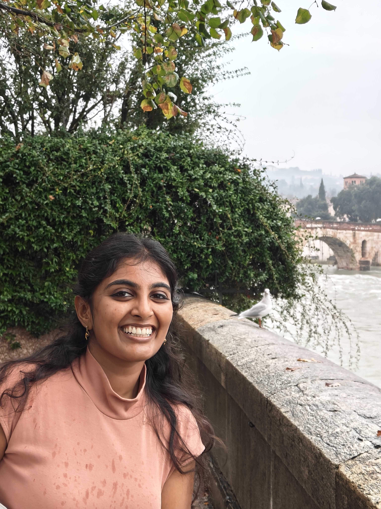

<table>
  <tr>
    <td>
      
    </td>
    <td>
     Hi! I’m a computational and molecular biology PhD student at the Weizmann Institute of Science, Israel. I’ve spent the last few years diving deep into sequencing data and conducting large-scale, high-throughput experiments to acquire it. I enjoy working with big data and finding simple, effective ways to communicate those insights.
    </td>
  </tr>
</table>
 

Hi! I’m a computational and molecular biology PhD student at the Weizmann Institute of Science, Israel. I’ve spent the last few years diving deep into sequencing data and conducting large-scale, high-throughput experiments to acquire it. I enjoy working with big data and finding simple, effective ways to communicate those insights.

## Academic Journey
I did my undergrad at the Indian Institute of Science, where I majored in Biology. I then moved to Israel to do my Masters at the Weizmann Institute of Science, where I later continued for my PhD in Prof Naama Barkai's lab. 

## Inspirations
I was inspired to be a molecular biologist in high school, when I had first learned of the central dogma, despite not having a clue of what such a career would look like. I was set on my way to becoming a molecular biologist, until I took a course in the 3rd year of my undergrad: DNA protein interactions and Nanobiology, which opened my eyes to a very unique perspective on the same. Following this course, I worked in four single molecule labs. My interests have diversified since then, yet this course showed me the beauty of thinking of science from different perspectives, which has stuck with me. 

## Research Milestones
* mapped _in vivo_ binding profiles of over 300 transcription factor mutants in yeast
* analysed NGS sequencing data and developed tools to visualize and analyze biological patterns
* our study on TF IDRs was recommended in Faculty opinions
* mentored an undergraduate and masters student on two independent projects
* developing an _in vitro_ system to identify binding profiles of transcription factors and their disordered regions

## Reflections
Grad school is all about learning to solve new problems outside of your field of expertise. There isn't a defined path to a solution, and you learn the ability to pick up a new skill and learn any new topic.

## Links
[Weizmann Institute of Science](https://www.weizmann.ac.il/pages/)

[S Gabor](https://szabgab.com/)

Here is a cute panda for stopping by!

